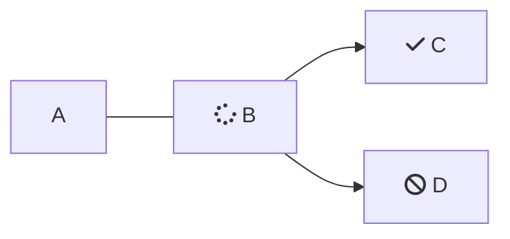

<Callout icon="📘" theme="info">
  hola
</Callout>

<HTMLBlock>{`
...
`}</HTMLBlock>

<Recipe slug="hello-world" title="Hola mundo" />

```mermaid
flowchart LR 
 A --- B[fa:fa-spinner B] 
 B --> C[fa:fa-check C] 
 B --> D[fa:fa-ban D]
```
